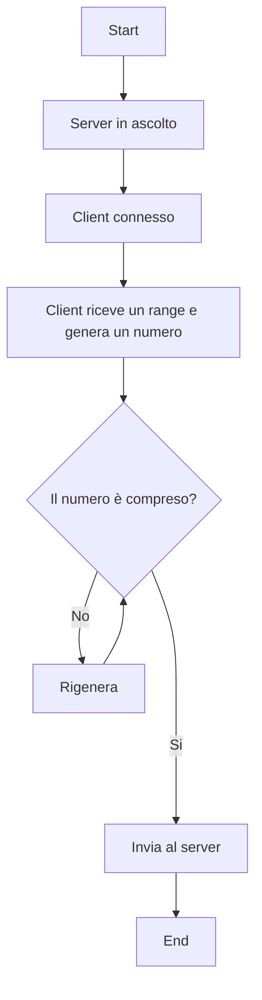

# Cattaneo-Socket

Invio da parte del client di un numero compreso in un range ricevuto dal server

```mermaid
flowchart TD
A[Start]
-->
B[Server in ascolto]
-->
C[Client connesso]
-->
D[Client riceve un range e genera un numero]
-->
E{Il numero è compreso?}
E -->|No| F[Rigenera]
F --> E
E ----> |Si| G[Invia al server]
G --> End
```
